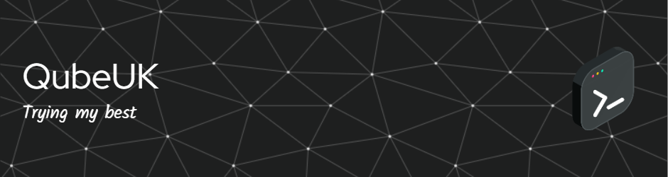

**`QubeUK (IT Professional)`**

### 🧰 Languages and Tools

           

### 🌱 Currently Learning

### Codewars

<!--

 

- 🔭 I’m currently working on ...
- 🌱 I’m currently learning ...
- 👯 I’m looking to collaborate on ...
- 🤔 I’m looking for help with ...
- 💬 Ask me about ...
- 📫 How to reach me: ...
- 😄 Pronouns: ...
- ⚡ Fun fact: ...
-->

### 📊 Stats

